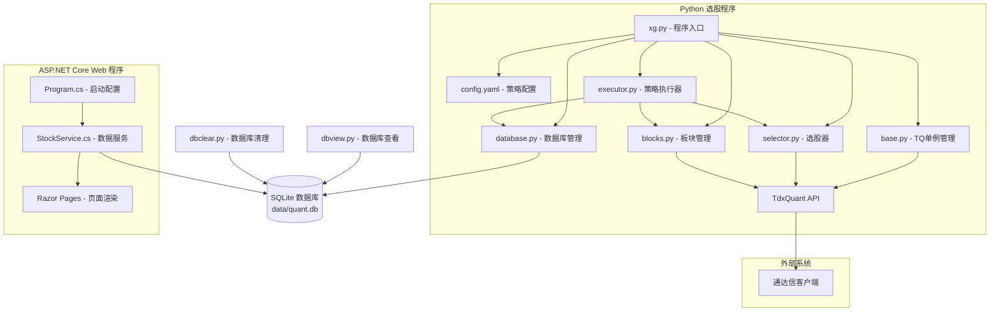
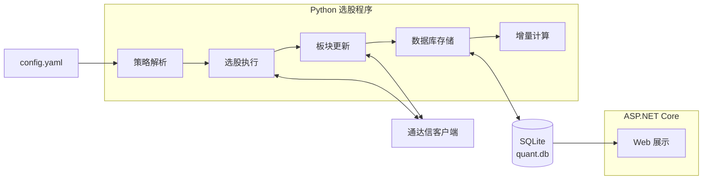

# 通达信 TdxQuant 选股系统

基于通达信 TdxQuant API 的自动化选股系统，由两个独立程序组成：

1. **Python 选股程序**（根目录） - 调用通达信公式引擎执行多策略组合选股，将结果写入 SQLite 数据库
2. **ASP.NET Core Web 展示程序**（`web/` 目录） - 读取数据库，展示每日选股结果

两个程序通过共享的 SQLite 数据库（`data/quant.db`）进行数据交互。

## 系统架构

### 整体架构图



### 核心数据流



### 选股策略流程

```
AAA (1054 支)
 |
 +- [1] below240w        : AAA -> X01 (低于五年周线)
 |
 +- [2] small_goodfund   : X01 -> X02 (微盘股基本面选股)
 |    +- X02_LTSZ100Y    : 流通市值 < 100 亿
 |    +- X03_MG_GOOD     : 净利润基本面良好
 |    +- X04_MG_GR_Q4    : 净利润同比增长且已出四季报/年报
 |    +- X05_GX_BT0      : 潜在股息 > 0
 |
 +- [3] buy_kdj_small    : X02 -> B00/B01/B02 (KDJ 买入信号)
 |    +- B00_KDJ5W       : KDJ 五周线
 |    +- B01_KDJ_DJC     : KDJ 低金叉
 |    +- B02_KDJ_GJC     : KDJ 高金叉
 |
 +- [4] buy_kdj_aaa      : AAA -> BA1/BA2 (AAA 板块 KDJ)
 |    +- B01_KDJ_DJC     : KDJ 低金叉
 |    +- B02_KDJ_GJC     : KDJ 高金叉
 |
 +- [5] db_update        : 数据库更新 (记录每日增量)
      +- B01 -> B01_delta
      +- B02 -> B02_delta
      +- BA1 -> BA1_delta
      +- BA2 -> BA2_delta
```

## 项目结构

```
tdx/
|-- config.yaml              # 选股策略配置（唯一定义选股逻辑）
|-- xg.py                    # 选股总入口（支持命令行参数）
|-- base.py                  # 公共模块（TQ 单例管理、常量定义）
|-- executor.py              # 策略执行器
|-- selector.py              # 选股器（公式执行、ST 过滤）
|-- database.py              # 数据库管理（存储、增量计算、清理）
|-- blocks.py                # 板块管理（TQ 板块 CRUD）
|-- logging_config.py        # 日志配置模块
|-- dbview.py                # 数据库查看工具（CLI）
|-- dbclear.py               # 数据库清理工具（CLI）
|-- pyproject.toml           # Python 项目配置
|-- data/
|   +-- quant.db             # SQLite 数据库（两个程序共享）
|-- web/                     # ASP.NET Core Web 展示程序
|   |-- Program.cs           # 启动配置
|   |-- web.csproj           # .NET 项目文件
|   |-- appsettings.json     # Web 应用配置
|   |-- Data/
|   |   +-- Stock.cs         # 实体类 + DbContext
|   |-- Services/
|   |   +-- StockService.cs  # 数据查询服务
|   +-- Pages/               # Razor Pages 页面
|       |-- Index.cshtml     # 首页
|       +-- Index/
|           |-- B01.cshtml   # B01 长线数据
|           |-- B02.cshtml   # B02 长线数据
|           |-- BA1.cshtml   # BA1 短线数据
|           +-- BA2.cshtml   # BA2 短线数据
+-- docs/                    # 开发文档
```

## 快速开始

### 1. Python 选股程序

```bash
# 执行全部选股策略
uv run python xg.py

# 执行单个策略
uv run python xg.py --strategy below240w

# 执行多个策略
uv run python xg.py --strategy below240w small_goodfund

# 查看策略列表
uv run python xg.py --list

# 查看策略详情
uv run python xg.py --info below240w
```

### 2. Web 展示程序

```bash
# 开发模式
.\start_web_dev.bat

# 生产模式
.\start_web.bat
```

### 3. 辅助工具

```bash
# 板块管理
uv run python blocks.py list
uv run python blocks.py info X01

# 数据库查看
uv run python dbview.py --tables
uv run python dbview.py --schema b01
uv run python dbview.py --data b01 -n 20

# 清空数据库
uv run python dbclear.py
```

## 选股策略

### 1. below240w - 低于五年周线

- 收盘价低于 240 周均线，前复权，自动过滤 ST
- AAA -> X01，公式 X01_BELOW240W，周线

### 2. small_goodfund - 微盘股基本面选股

4 步串行筛选（X01 -> X02）：
1. X02_LTSZ100Y: 流通市值 < 100 亿
2. X03_MG_GOOD: 净利润基本面良好
3. X04_MG_GR_Q4: 净利润同比增长且已出四季报/年报
4. X05_GX_BT0: 潜在股息 > 0

### 3. buy_kdj_small - KDJ 买入信号（微盘股）

X02 -> B00/B01/B02，3 个公式并行输出：
- B00_KDJ5W: KDJ 五周线（周线）
- B01_KDJ_DJC: KDJ 低金叉（日线）
- B02_KDJ_GJC: KDJ 高金叉（日线）

### 4. buy_kdj_aaa - KDJ 买入信号（AAA 板块）

AAA -> BA1/BA2，2 个公式并行输出：
- B01_KDJ_DJC: KDJ 低金叉（日线）
- B02_KDJ_GJC: KDJ 高金叉（日线）

### 5. db_update - 数据库更新

- 保存当日板块数据，计算增量（新增/减少）
- 记录买点 EMA(C,2) 和入选日期
- 长线板块：B01, B02；短线板块：BA1, BA2
- 数据保留：10 天

## 策略类型说明

| 类型 | 说明 | 配置项 |
|------|------|--------|
| `single` | 单公式选股 | `source_block`, `target_block`, `formula_name`, `stock_period` |
| `multi` | 多公式串行选股 | `source_block`, `target_block`, `formulas` (公式列表) |
| `parallel` | 多公式并行选股 | `source_block`, `formulas` (每项含 `formula_name`, `target_block`, `stock_period`) |
| `db_update` | 数据库更新 | `long_term_blocks`, `short_term_blocks`, `keep_days` |

## 技术栈

| 组件 | 技术 | 说明 |
|------|------|------|
| 选股引擎 | Python 3.14 + TdxQuant API | 调用通达信公式执行选股 |
| 数据存储 | SQLite | 共享数据库 `data/quant.db` |
| Web 展示 | ASP.NET Core 10 + Razor Pages | EF Core 读取展示 |
| 依赖管理 | uv (Python) / NuGet (.NET) | 各自独立管理 |
| 日期处理 | UTC 存储 + 北京时间 (UTC+8) 显示 | 统一日期规范 |

## 环境要求

- **操作系统**: Windows 10/11（通达信仅支持 Windows）
- **Python**: 3.14+，使用 [uv](https://github.com/astral-sh/uv) 管理依赖
- **.NET**: 10.0 SDK（Web 展示程序）
- **通达信客户端**: 已安装并登录

## 前置条件

1. **通达信客户端** 已安装并登录
2. **选股公式** 已在通达信客户端中创建：
   - X01_BELOW240W, X02_LTSZ100Y, X03_MG_GOOD
   - X04_MG_GR_Q4, X05_GX_BT0
   - B00_KDJ5W, B01_KDJ_DJC, B02_KDJ_GJC

## 注意事项

1. **数据刷新**：运行选股前建议在通达信客户端中刷新盘后数据
2. **公式创建**：所有选股公式需要在通达信客户端中预先创建
3. **ST 过滤**：程序会自动过滤 ST 股票
4. **复权设置**：默认使用前复权数据
5. **TQ 管理**：系统使用单一 TQ 实例，由 `xg.py` 统一管理
6. **数据库共享**：选股程序写入，Web 程序只读，注意并发访问

## 许可证

MIT License
