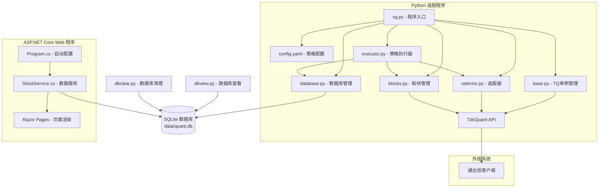
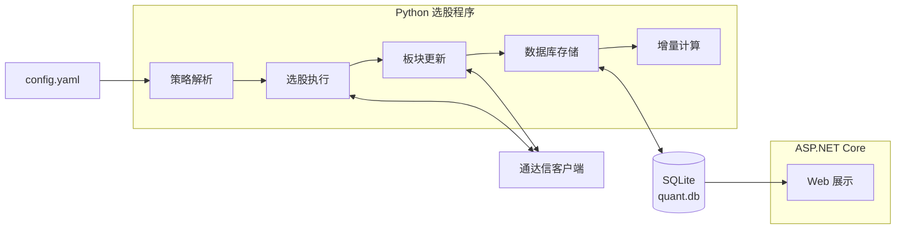

# 通达信 TdxQuant 选股系统

基于通达信 TdxQuant API 的自动化选股系统，由两个独立程序组成：

1. **Python 选股程序**（根目录） - 调用通达信公式引擎执行多策略组合选股，将结果写入 SQLite 数据库
2. **ASP.NET Core Web 展示程序**（`web/` 目录） - 读取数据库，展示每日选股结果

两个程序通过共享的 SQLite 数据库（`data/quant.db`）进行数据交互。`data/` 目录为运行时目录，不纳入 Git；程序会在首次运行时自动创建该目录和数据库文件。

## 系统架构

### 整体架构图



### 核心数据流



选股策略说明已拆分到：[`data/xg.md`](data/xg.md)

## 项目结构

```
tdx/
|-- config.yaml              # 选股策略配置（唯一定义选股逻辑）
|-- xg.py                    # 选股总入口（支持命令行参数）
|-- base.py                  # 公共模块（TQ 单例管理、常量定义）
|-- executor.py              # 策略执行器
|-- selector.py              # 选股器（公式执行、ST 过滤）
|-- database.py              # 数据库管理（存储、增量计算、清理）
|-- blocks.py                # 板块管理（TQ 板块 CRUD）
|-- logging_config.py        # 日志配置模块
|-- dbview.py                # 数据库查看工具（CLI）
|-- dbclear.py               # 数据库清理工具（CLI）
|-- pyproject.toml           # Python 项目配置
|-- data/                    # 运行时自动创建（已被 .gitignore 忽略）
|   +-- quant.db             # SQLite 数据库（首次运行自动创建）
|-- web/                     # ASP.NET Core Web 展示程序
|   |-- Program.cs           # 启动配置
|   |-- web.csproj           # .NET 项目文件
|   |-- appsettings.json     # Web 应用配置
|   |-- Data/
|   |   +-- Stock.cs         # 实体类 + DbContext
|   |-- Services/
|   |   +-- StockService.cs  # 数据查询服务
|   +-- Pages/               # Razor Pages 页面
|       |-- Index.cshtml     # 首页
|       +-- Index/
|           |-- B01.cshtml   # B01 长线数据
|           |-- B02.cshtml   # B02 长线数据
|           |-- BA1.cshtml   # BA1 短线数据
|           +-- BA2.cshtml   # BA2 短线数据
+-- docs/                    # 开发文档
```

## 快速开始

### 1. Python 选股程序

```bash
# 执行全部选股策略
uv run python xg.py

# 执行单个策略
uv run python xg.py --strategy below240w

# 执行多个策略
uv run python xg.py --strategy below240w small_goodfund

# 查看策略列表
uv run python xg.py --list

# 查看策略详情
uv run python xg.py --info below240w
```

### 2. Web 展示程序

```bash
# 启动 Web 展示程序
.\start_web.bat

# 或直接运行（等效）
cd .\web
dotnet run --urls "http://localhost:5000"
```

### 3. 辅助工具

```bash
# 板块管理
uv run python blocks.py list
uv run python blocks.py info X01

# 数据库查看
uv run python dbview.py --tables
uv run python dbview.py --schema b01
uv run python dbview.py --data b01 -n 20

# 清空数据库
uv run python dbclear.py
```

## 选股策略

详见：[`data/xg.md`](data/xg.md)

## 技术栈

| 组件 | 技术 | 说明 |
|------|------|------|
| 选股引擎 | Python 3.14 + TdxQuant API | 调用通达信公式执行选股 |
| 数据存储 | SQLite | 共享数据库 `data/quant.db` |
| Web 展示 | ASP.NET Core 10 + Razor Pages | EF Core 读取展示 |
| 依赖管理 | uv (Python) / NuGet (.NET) | 各自独立管理 |
| 日期处理 | UTC 存储 + 北京时间 (UTC+8) 显示 | 统一日期规范 |

## 环境要求

- **操作系统**: Windows 10/11（通达信仅支持 Windows）
- **Python**: 3.14+，使用 [uv](https://github.com/astral-sh/uv) 管理依赖
- **.NET**: 10.0 SDK（Web 展示程序）
- **通达信客户端**: 已安装并登录

## 前置条件

1. **通达信客户端** 已安装并登录
2. **选股公式** 已在通达信客户端中创建：
   - X01_BELOW240W, X02_LTSZ100Y, X03_MG_GOOD
   - X04_MG_GR_Q4, X05_GX_BT0
   - B00_KDJ5W, B01_KDJ_DJC, B02_KDJ_GJC

## 注意事项

1. **数据刷新**：运行选股前建议在通达信客户端中刷新盘后数据
2. **公式创建**：所有选股公式需要在通达信客户端中预先创建
3. **ST 过滤**：程序会自动过滤 ST 股票
4. **复权设置**：默认使用前复权数据
5. **TQ 管理**：系统使用单一 TQ 实例，由 `xg.py` 统一管理
6. **数据库共享**：选股程序写入，Web 程序只读，注意并发访问

## TdxQuant 接口已知问题

1. **初始化依赖客户端状态**：通达信未启动或未登录时，TQ 初始化会失败。  
2. **板块操作存在同步延迟**：创建/删除/写入板块后可能短时间不可见，已通过 `tq_delay_ms` 进行缓冲。  
3. **返回结构不完全一致**：`ErrorId` 可能为字符串或数字，错误字段可能出现 `Error` / `ErrorMsg` 混用。  
4. **选股结果键名不稳定**：不同公式返回中可能使用 `XG`、`SELECT`、`BUY`、`OUTPUT` 等键表示命中。  
5. **底层错误输出难完全抑制**：部分错误由底层库直接输出到控制台，Python 层重定向无法 100% 屏蔽。  
6. **幂等性一般**：重复执行同一板块操作结果可能不同，建议采用“存在性检查 + 重试 + 复查”策略。

## 许可证

MIT License
