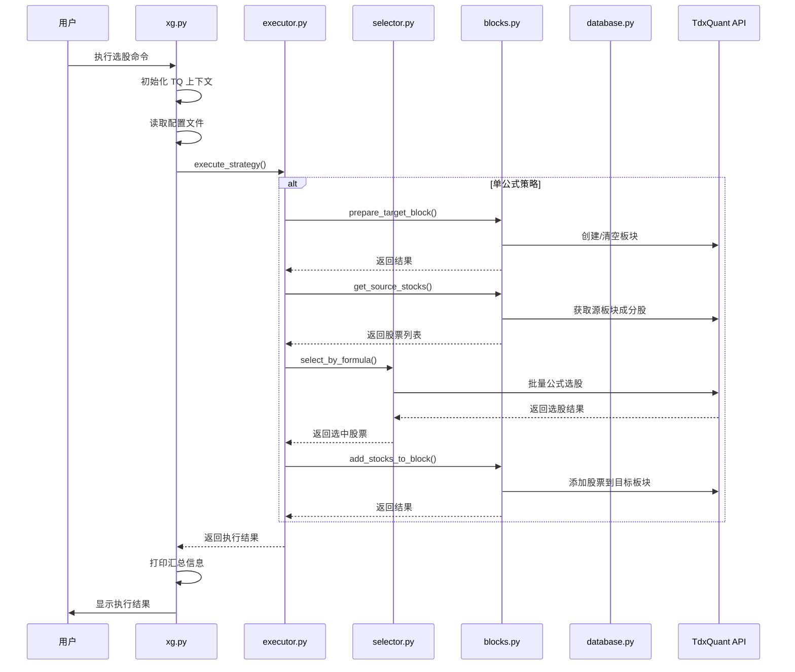

# TDX 系统设计文档 (DESIGN.md)

## 1. 系统架构设计

### 1.1 整体架构图

本项目由两个独立程序组成，通过共享 SQLite 数据库协作：

```
┌─────────────────────────────────────────────────────────────┐
│                      用户层 (User Layer)                     │
├─────────────────────────────────────────────────────────────┤
│  命令行界面  │  配置文件  │  数据库查看工具  │  Web 浏览器   │
└──────┬──────────┬────────────┬──────────────────┬───────────┘
       │          │            │                  │
┌──────▼──────────▼────────────▼────────────┐ ┌──▼─────────────────────┐
│      Python 选股程序 (根目录)               │ │  ASP.NET Core Web 程序  │
│      Application Layer                    │ │  (web/ 目录)            │
├───────────────────────────────────────────┤ ├─────────────────────────┤
│  xg.py (入口)    │  executor.py (策略执行)  │ │  Program.cs (启动配置)  │
│  base.py (TQ管理) │  config.yaml (配置)     │ │  StockService.cs (查询) │
├───────────────────────────────────────────┤ │  Razor Pages (页面)     │
│  selector.py (选股) │ database.py (存储)    │ └────────────┬────────────┘
│  blocks.py (板块)   │ logging_config.py     │              │
└──────┬──────────┬────────────────────┬────┘              │
       │          │                    │                    │
┌──────▼──────────▼────────────────────▼────────────────────▼─┐
│                    数据访问层 (Data Access Layer)            │
├─────────────────────────────────────────────────────────────┤
│       TdxQuant API          │      SQLite (data/quant.db)   │
│   (仅 Python 选股程序)       │    (两个程序共享，写/读分离)    │
└─────────────────────────────────────────────────────────────┘
```

### 1.2 模块职责划分

#### Python 选股程序

| 模块 | 职责 | 核心类 |
|------|------|--------|
| **xg.py** | 程序入口、命令行解析、流程控制 | `main()` |
| **base.py** | TQ 单例管理、配置读取、常量定义 | `init_tq_context()`, `get_tq()` |
| **executor.py** | 策略路由分发、不同类型策略执行 | `execute_strategy()` 及其变体 |
| **selector.py** | 股票筛选、ST 过滤、公式执行 | `StockSelector` |
| **database.py** | 数据持久化、增量计算、日志记录 | `StockDatabase` |
| **blocks.py** | 板块生命周期管理、TQ API 封装 | `BlockManager` |
| **logging_config.py** | 日志配置、异常装饰器 | `setup_logging()`, `log_exceptions` |

#### ASP.NET Core Web 展示程序

| 模块 | 职责 | 核心类 |
|------|------|--------|
| **Program.cs** | 启动配置、DI 注册、中间件管道 | - |
| **Data/Stock.cs** | 实体定义、DbContext | `StockBase`, `DeltaStockBase`, `TdxDbContext` |
| **Services/StockService.cs** | 数据库查询服务 | `StockService` |
| **Pages/** | Razor Pages 页面渲染 | `B01Model`, `B02Model`, `BA1Model`, `BA2Model` |

---

## 2. 核心类设计

### 2.1 StockSelector 类

```python
class StockSelector:
    """选股器 - 负责股票筛选逻辑"""
    
    def __init__(self) -> None:
        self.tq = get_tq()  # 获取全局 TQ 实例
        
    def select_by_formula(
        self, 
        stock_list: List[str], 
        formula_name: str, 
        stock_period: Optional[str] = None,
        filter_st: bool = True
    ) -> List[str]:
        """使用通达信公式引擎选股"""
        # 1. 过滤 ST 股票（可选）
        # 2. 分批处理（每批200支）
        # 3. 调用 TQ API
        # 4. 解析结果
        pass
        
    def is_st_stock(self, stock_code: str) -> bool:
        """判断是否为 ST 股票"""
        pass
```

### 2.2 BlockManager 类

```python
class BlockManager:
    """板块管理器 - 封装 TQ 板块操作"""
    
    def __init__(self, tq, delay_ms: Optional[int] = None):
        self.tq = tq
        self.delay_ms = delay_ms or 100
        
    def get_block_stocks(self, block_code: str) -> List[str]:
        """获取板块成分股"""
        pass
        
    def prepare_target_block(self, block_code: str, block_name: str) -> bool:
        """准备目标板块（创建或清空）"""
        pass
```

### 2.3 StockDatabase 类

```python
class StockDatabase:
    """数据库管理器 - 股票数据持久化"""
    
    def __init__(self, db_path: str):
        self.db_path = Path(db_path)
        
    def save_stocks(self, table_name: str, stock_data: Dict[str, str], record_date: str) -> None:
        """保存选股结果"""
        pass
        
    def process_block(self, block_config: Dict[str, Any], block_manager, keep_days: int) -> Dict:
        """处理板块数据（增量计算）"""
        pass
        
    @staticmethod
    def calculate_delta(curr_db: Dict[str, str], prev_db: Dict[str, str]) -> Tuple[set, set]:
        """计算增量"""
        pass
```

---

## 3. 数据流设计

### 3.1 选股执行流程



### 3.2 数据库存储流程

```mermaid
flowchart TD
    A[获取当前板块数据] --> B[保存到主表]
    B --> C[获取前一日数据]
    C --> D[计算增量]
    D --> E[保存增量到delta表]
    E --> F[计算买点EMA(C,2)]
    F --> G[保存买点数据]
    G --> H[记录更新日志]
    H --> I[清理过期数据]
```

---

## 4. 接口设计

### 4.1 模块间接口契约

#### Selector 接口
```python
class IStockSelector(Protocol):
    def select_by_formula(
        self, 
        stock_list: List[str], 
        formula_name: str, 
        stock_period: Optional[str] = None
    ) -> List[str]: ...
    
    def is_st_stock(self, stock_code: str) -> bool: ...
```

#### BlockManager 接口
```python
class IBlockManager(Protocol):
    def get_block_stocks(self, block_code: str) -> List[str]: ...
    def prepare_target_block(self, block_code: str, block_name: str) -> bool: ...
    def add_stocks_to_block(self, block_code: str, stocks: List[str]) -> Dict: ...
```

#### Database 接口
```python
class IDatabase(Protocol):
    def save_stocks(self, table_name: str, stock_data: Dict[str, str], record_date: str) -> None: ...
    def get_stocks_by_date(self, table_name: str, record_day: str) -> Dict[str, str]: ...
    def process_block(self, block_config: Dict[str, Any], block_manager, keep_days: int) -> Dict: ...
```

---

## 5. 扩展性设计

### 5.1 策略扩展点

```python
# 新增策略类型只需：
# 1. 在 executor.py 中添加执行函数
def execute_custom_strategy(config, selector, block_manager):
    # 自定义逻辑
    pass

# 2. 在路由中注册
STRATEGY_EXECUTORS = {
    'single': execute_single_strategy,
    'multi': execute_multi_strategy,
    'parallel': execute_parallel_strategy,
    'db_update': execute_db_update,
    'custom': execute_custom_strategy,  # 新增
}
```

### 5.2 钩子机制

```python
class StrategyHooks:
    """策略执行钩子"""
    
    @staticmethod
    def before_execute(config: Dict) -> None:
        """执行前钩子"""
        logger.info(f"开始执行策略: {config['name']}")
        
    @staticmethod
    def after_execute(config: Dict, result: Dict) -> None:
        """执行后钩子"""
        logger.info(f"策略执行完成: {config['name']}, 结果: {result}")
```

---

## 6. 错误处理设计

### 6.1 异常层次结构

```
Exception
 ├── SelectionError          # 选股相关错误
 │    ├── FormulaError       # 公式执行错误
 │    └── StockFilterError   # 股票过滤错误
 ├── DatabaseError           # 数据库错误
 │    ├── ConnectionError    # 连接错误
 │    └── QueryError         # 查询错误
 ├── BlockOperationError     # 板块操作错误
 └── ConfigurationError      # 配置错误
```

### 6.2 重试机制设计

```python
@retry(
    stop=stop_after_attempt(3),
    wait=wait_fixed(1),
    retry=retry_if_exception_type((ConnectionError, TimeoutError)),
    reraise=True
)
def risky_operation():
    # 可能失败的操作
    pass
```

---

## 7. 性能设计考虑

### 7.1 缓存策略

```python
# LRU 缓存装饰器
@lru_cache(maxsize=1000)
def get_stock_info_cached(stock_code: str) -> dict:
    return tq.get_stock_info(stock_code)

# 批量缓存预热
def warm_up_cache(stock_codes: List[str]):
    for code in stock_codes:
        get_stock_info_cached(code)
```

### 7.2 连接池设计

```python
class DatabaseConnectionPool:
    """简单的数据库连接池"""
    
    def __init__(self, db_path: str, pool_size: int = 5):
        self.db_path = db_path
        self.pool = queue.Queue(maxsize=pool_size)
        self._initialize_pool()
        
    def get_connection(self):
        return self.pool.get()
        
    def release_connection(self, conn):
        self.pool.put(conn)
```

---

## 8. 安全设计

### 8.1 输入验证

```python
def validate_table_name(name: str) -> bool:
    """严格的表名验证"""
    pattern = re.compile(r'^[a-zA-Z_][a-zA-Z0-9_]*$')
    return bool(pattern.match(name))

def validate_stock_code(code: str) -> bool:
    """股票代码验证"""
    pattern = re.compile(r'^\d{6}$')
    return bool(pattern.match(code))
```

### 8.2 SQL 注入防护

```python
# ❌ 危险：字符串拼接
query = f"SELECT * FROM {table} WHERE code = '{user_input}'"

# ✅ 安全：参数化查询
cursor.execute("SELECT * FROM ? WHERE code = ?", (table, user_input))
```

---

## 9. 部署架构

### 9.1 生产环境部署图

```
┌─────────────────────────────────────────────────────────────┐
│                        负载均衡器                            │
└─────────────┬─────────────────────────────┬─────────────────┘
              │                             │
    ┌─────────▼─────────┐         ┌─────────▼─────────┐
    │   Web 服务器 1    │         │   Web 服务器 2    │
    │  (ASP.NET Core)   │         │  (ASP.NET Core)   │
    └─────────┬─────────┘         └─────────┬─────────┘
              │                             │
    ┌─────────▼─────────┐         ┌─────────▼─────────┐
    │   Python Worker   │         │   Python Worker   │
    │   (选股引擎)      │         │   (选股引擎)      │
    └─────────┬─────────┘         └─────────┬─────────┘
              │                             │
    ┌─────────▼─────────────────────────────▼─────────┐
    │              共享 SQLite 数据库                   │
    └─────────────────────────────────────────────────┘
```

### 9.2 数据流向

```
用户请求 → Web层 → 消息队列 → Worker进程 → TQ API → 数据库 → 返回结果
```
